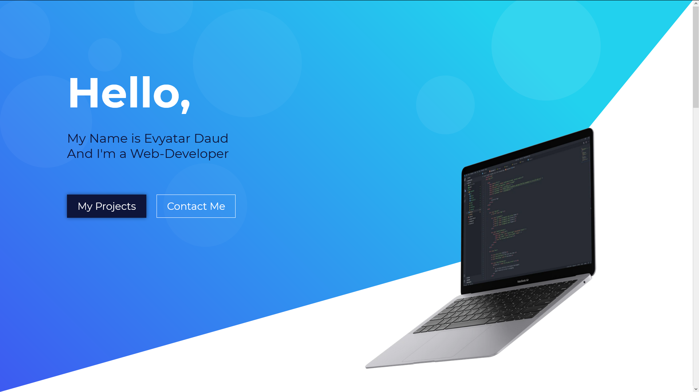

# My Portfolio

My portfolio website, created using React, Next.js, Adobe XD and [Mokup Frames](https://www.mokupframes.com/)

> Note: There is no reason whatsoever to use React and/or Next.js for this project, I just wanted to try out Next.js' SSG (Static Site Generation) feature on a GitHub-Pages deployment 
> 
> (Hint: make sure to add a .nojekyll in your build folder...)

## Installation:

Clone this repo, then `npm i && npm run dev`

## Available commands:

### `npm run dev`

Runs the app in the development mode.

Open [http://localhost:3000](http://localhost:3000) to view it in the browser.

### `npm run build`

Builds the app for production to the `.next` & `out` directories.

### `npm run deploy`

Builds the app and publishes to GitHub Pages.